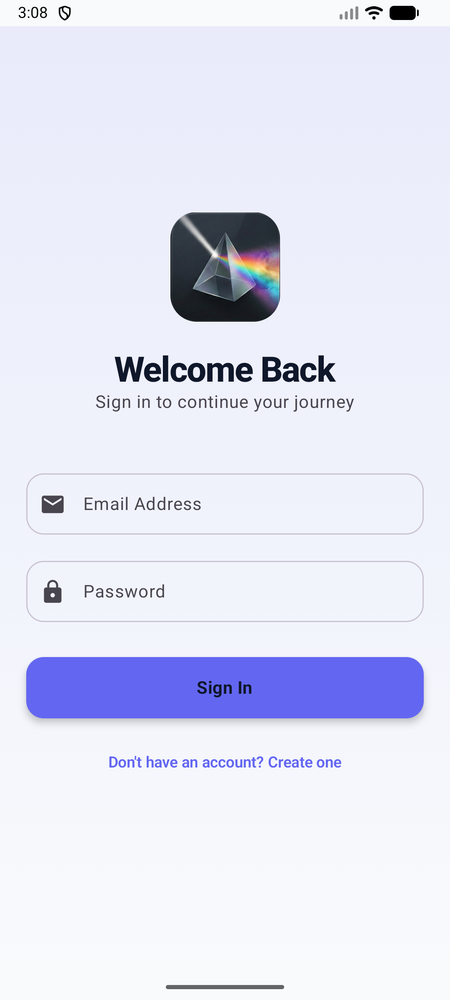
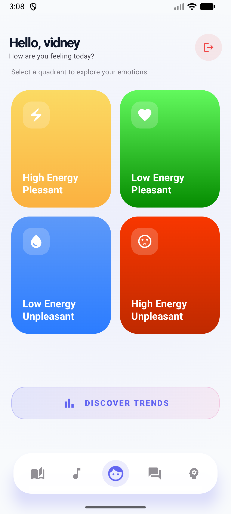
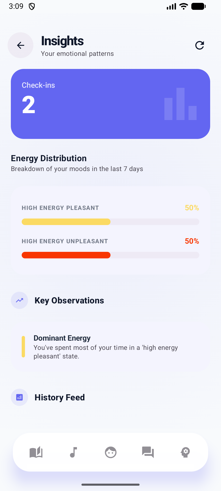
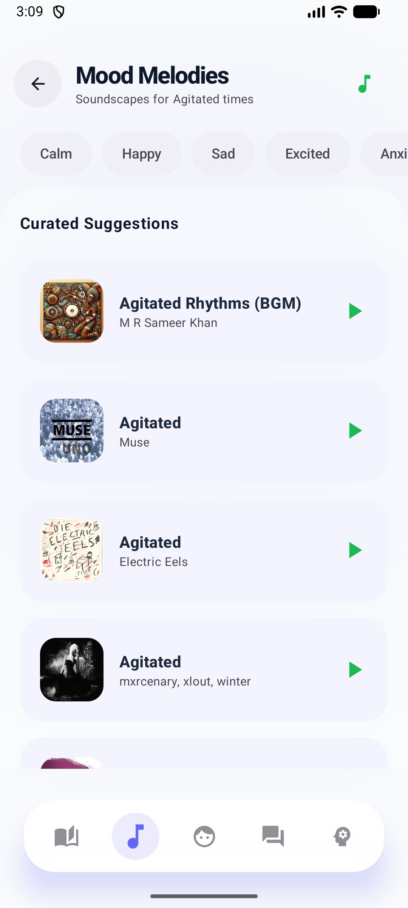
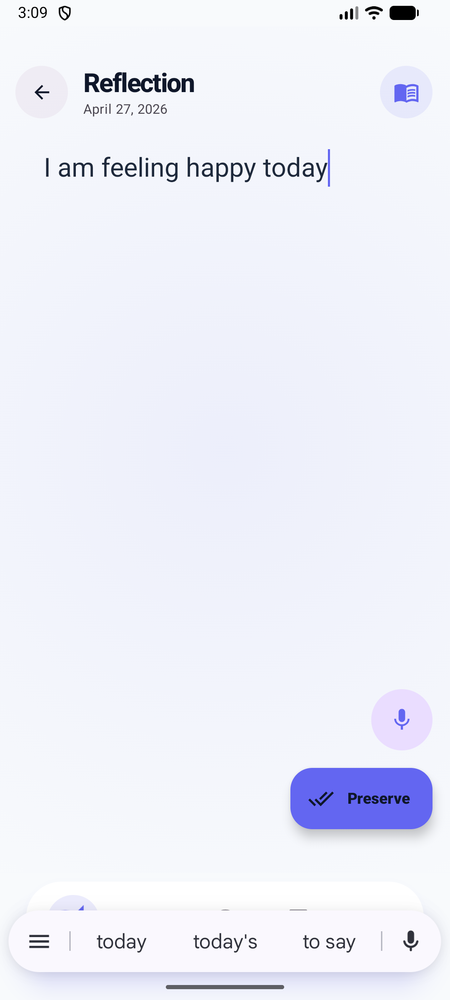
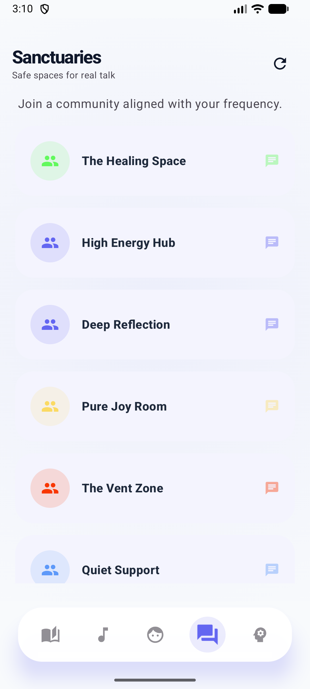
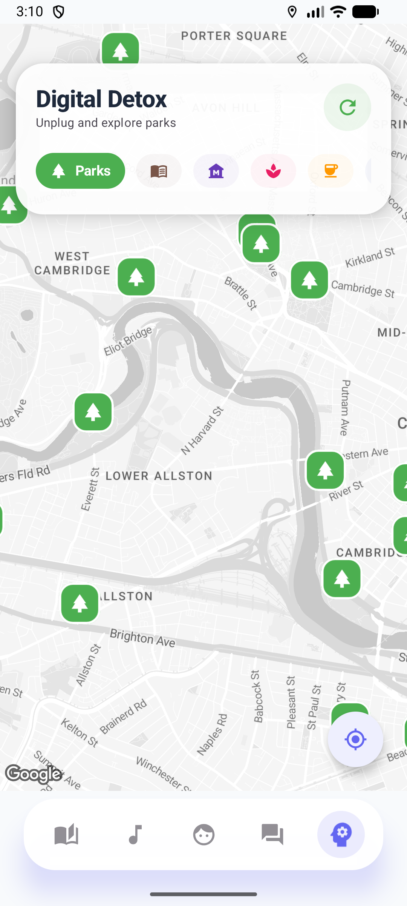

## Unfiltered - Your Emotional Companion 

*Unfiltered* is a modern Android application designed for emotional well-being. It helps users track their moods, journal their thoughts, connect with others in real-time community chat rooms, discover music based on how they feel, and find nearby places for a digital detox — all wrapped in a sleek, dark-themed UI.

Built entirely with *Jetpack Compose* (100% Kotlin) and backed by a *Node.js / PostgreSQL* REST + WebSocket API.

---

## 🚨 Important: Code Contribution Review

> **Please review our separate contribution breakdown repository for individual code ownership:**  
> 🔗 **https://github.com/ashish19-bu/UnfilteredApp-Code-Contributions**

This project was completed collaboratively by all team members, with each person responsible for specific frontend and backend components.

Earlier in development, some commits were pushed through shared or centralized accounts, so the commit history in this working repository does not fully represent each individual’s contribution. After asking for clarification on Piazza, we understood that contribution visibility was important.

We initially considered separating work through branches in the main working repository, but modifying the working app structure created instability and risked breaking the final running version. To keep the working app safe, we created a separate contribution-review repository that organizes the final code by responsibility.

✅ **Main repo:** working application  
✅ **Contribution repo:** individual code contribution breakdown  

---

### 🏗️ Architecture

#### MVVM Pattern

- **View Layer**
  - Built using Jetpack Compose UI
  - Screens include:
    - Login / Signup
    - Mood Selection
    - Journal
    - Music
    - Chat Rooms
    - Detox Map

- **ViewModel Layer**
  - Handles state management using **StateFlow**
  - Uses **Kotlin Coroutines** for asynchronous operations

- **Data Layer**
  - Implements **Repository Pattern**
  - API integration using:
    - Retrofit (REST APIs)
    - Socket.io (real-time communication)


---

### 🗄️ Backend & Database

- **Backend**: Node.js (Express) deployed on Render  
- **Database**: PostgreSQL (NeonDB)  
- **Authentication**: JWT-based login system  
- **ORM**: Knex.js for schema migrations
- **NEON**


- **Render**


---

## 🔀 Navigation Flow

The app uses a *single-activity, type-safe* navigation graph:

| Route | Screen |
|---|---|
| Splash | Animated splash screen |
| Login | Login form |
| Signup | Registration form |
| MoodCategory | 4-quadrant mood energy home screen |
| MoodSubSelection(modeType) | Granular mood selection |
| MoodSummary | Post-mood-selection summary |
| Journal | Personal journal |
| Music | Spotify mood music |
| Rooms | Chat room list |
| Chat(roomId, roomName, moodTag, description) | Live chat room |
| Detox | Google Maps detox explore |
| Analytics | Mood analytics dashboard |


---

## ✨ Features

| Feature | Description | Status |
|---|---|---|
| 🎭 *Mood Wheel* | A comprehensive wheel with 100+ mood sub-types across 4 energy quadrants. Users select their current mood each session. | ✅ Completed |
| 📊 *Mood Analytics* | Visual analytics dashboard showing mood logs over the past 7 days — total logs, mood distribution, and daily breakdowns. | ✅ Completed |
| 📓 *Journal* | A personal journal where users can write and view past entries, all stored securely in the backend. | ✅ Completed |
| 🎵 *Music* | Spotify-powered music recommendations that match the user's current mood using the Spotify Web API. |   ✅ Completed |
| 💬 *Sanctuaries (Chat)* | Real-time community chat rooms powered by *Socket.io*. Rooms are tagged by mood for contextual conversations. | ✅ Completed |
| 🗺️ *Detox & Explore* | Location-based "digital detox" feature. Uses *Google Maps* + *Places API* to show nearby parks, cafes, gyms, and restaurants based on the user's current location. | ✅ Completed |
| 🔐 *Auth* | Full email/password registration and login with *JWT* token-based authentication. Auto-login on app restart via persisted token. | ✅ Completed |

## 🧪 Testing Strategy

The application uses a combination of debugging, manual testing, and API validation to ensure reliability and performance.

---

### 🔹 Runtime Debugging

- Android Studio Logcat for StateFlow & ViewModel logs  
- Breakpoints for state inspection  
- Network Inspector for API call tracing  
- Socket.io logs for real-time chat debugging  

---

### 🔹 Manual Testing

- End-to-end flow: Login → Mood → Journal → Music → Chat  
- Mood navigation tested across all 4 quadrants  
- Journal (text + voice) tested on physical device  
- Maps tested using live GPS location  

---

### 🔹 Auth & State Testing

- JWT persistence tested across app restarts  
- Auto-login validation via Splash screen  
- Session expiry and logout handling  
- SharedPreferences token storage verified  

---

### 🔹 API & Database Testing

- Postman used for API endpoint testing  
- NeonDB Studio used for database validation  
- Knex migrations verified  
- Render logs monitored for backend errors  
---
## 📁 Project Structure

```text
UnfilteredApp/
├── app/src/main/java/com/example/unfilteredapp/
│   ├── MainActivity.kt              # Single Activity — sets up nav graph + bottom bar
│   ├── data/
│   │   ├── api/
│   │   │   ├── NetworkConstants.kt  # BASE_URL, SOCKET_URL, MAPS_API_KEY
│   │   │   ├── AuthApi.kt           # /auth/register, /auth/login, /auth/me
│   │   │   ├── ChatApi.kt           # /rooms, /rooms/:id/messages
│   │   │   ├── JournalApi.kt        # /journal
│   │   │   ├── MoodApi.kt           # /mood/log, /mood/analytics
│   │   │   ├── PlacesApi.kt         # Google Places Nearby Search
│   │   │   ├── SpotifyApi.kt        # Spotify /v1/search, /v1/recommendations
│   │   │   └── SpotifyAuthApi.kt    # Spotify /api/token (Client Credentials)
│   │   ├── model/
│   │   │   ├── AuthModels.kt        # AuthRequest, RegistrationRequest, AuthResponse, User
│   │   │   ├── ChatModels.kt        # Room, Message (handles both snake_case & camelCase)
│   │   │   ├── JournalModels.kt     # JournalEntryRequest, JournalEntryResponse
│   │   │   ├── MoodData.kt          # 100+ MoodSubType entries across 4 quadrants
│   │   │   ├── MoodAnalyticsModels.kt # MoodLogRequest, AnalyticsResponse, DailyLog
│   │   │   ├── PlaceData.kt         # PlacesResponse, PlaceResult
│   │   │   └── SpotifyModels.kt     # SpotifyTrack, SpotifySearchResponse
│   │   └── repository/
│   │       ├── AuthRepository.kt    # Login, register, token persist (SharedPreferences)
│   │       ├── ChatRepository.kt    # Fetch rooms & messages
│   │       ├── JournalRepository.kt # Get/save journal entries
│   │       ├── MoodRepository.kt    # Log mood, get analytics
│   │       ├── PlacesRepository.kt  # Nearby places search via Google API
│   │       └── SpotifyRepository.kt # Client Credentials token + track search
│   ├── ui/
│   │   ├── screens/
│   │   │   ├── SplashScreen.kt      # Animated splash → auto-login check
│   │   │   ├── LoginScreen.kt       # Email + password login
│   │   │   ├── SignupScreen.kt      # Name, email, password registration
│   │   │   ├── MoodCategoryScreen.kt# 4-quadrant mood energy selector
│   │   │   ├── MoodSubSelectionScreen.kt # Granular mood picker
│   │   │   ├── MoodSummaryScreen.kt # Summary + navigation after mood pick
│   │   │   ├── AnalyticsScreen.kt   # 7-day mood analytics charts
│   │   │   ├── JournalScreen.kt     # Write and view journal entries
│   │   │   ├── MusicScreen.kt       # Spotify mood-based track recommendations
│   │   │   ├── RoomsScreen.kt       # List of mood-tagged chat rooms
│   │   │   ├── ChatScreen.kt        # Real-time Socket.io chat
│   │   │   └── DetoxScreen.kt       # Google Maps + nearby place categories
│   │   └── theme/                   # Material 3 color scheme, typography
│   └── viewmodel/
│       ├── AuthViewModel.kt         # Login/register/logout + auto-login
│       ├── ChatViewModel.kt         # Socket.io lifecycle + optimistic UI
│       ├── JournalViewModel.kt      # Fetch/add journal entries
│       ├── MoodAnalyticsViewModel.kt# Log mood + fetch analytics
│       ├── MoodViewModel.kt         # In-memory selected mood state
│       ├── MusicViewModel.kt        # Spotify track loading by mood
│       └── PlacesViewModel.kt       # Nearby places via Google Places API
└── gradle/
    └── libs.versions.toml           # Centralized dependency version catalog
```
## 🤖 AI Usage Statement

AI tools (primarily ChatGPT) were used during the development of this project as a support tool, not as a replacement for understanding.

### 🔹 Where & How AI Was Used
- Used to **brainstorm feature ideas** (e.g., mood tracking, anonymous chat rooms)
- Helped in **debugging errors** in Kotlin, API calls, and Gradle issues
- Assisted in **understanding concepts** like MVVM architecture, StateFlow, and API integration
- Provided guidance for **UI improvements in Jetpack Compose**
- Helped refine **README documentation and structure**

### 🔹 Example Prompts
- "Help me understand this part of my ViewModel code and how data is flowing"
- "Explain how StateFlow is being used in my app and why it is better than LiveData here"
- "Where should I store and use API keys like Spotify and Google Maps in my Android project?"
- "Why is my Retrofit API call not returning data even though the endpoint is correct?"
- "Help me debug this issue where my UI is not updating after state change"
- "How do I integrate Socket.io properly for real-time chat in Android?"
- "What is the correct way to structure MVVM in a multi-screen Compose app?"

### 🔹 Helpfulness
AI was helpful in:
- Speeding up debugging and reducing development time  
- Explaining complex concepts in a simpler way  
- Suggesting better structure and design approaches  

### 🔹 Limitations & Corrections
- Some AI suggestions were **generic or not directly compatible** with the project setup  
- Required **manual modification and debugging** to fit the app’s architecture  
- Certain API integrations (e.g., Socket.io, Spotify) needed **custom fixes beyond AI suggestions**  
- Verified outputs using official documentation and testing  

### 🔹 Understanding
All AI-generated suggestions were **carefully reviewed, tested, and modified** before implementation.  
The final code reflects my understanding of:
- MVVM architecture  
- State management using StateFlow  
- API integration and asynchronous programming  

---
## 📸 Update 2 Screenshots

<p align="center">
  
  
  
  
</p>

<p align="center">
  
  
  
</p>

